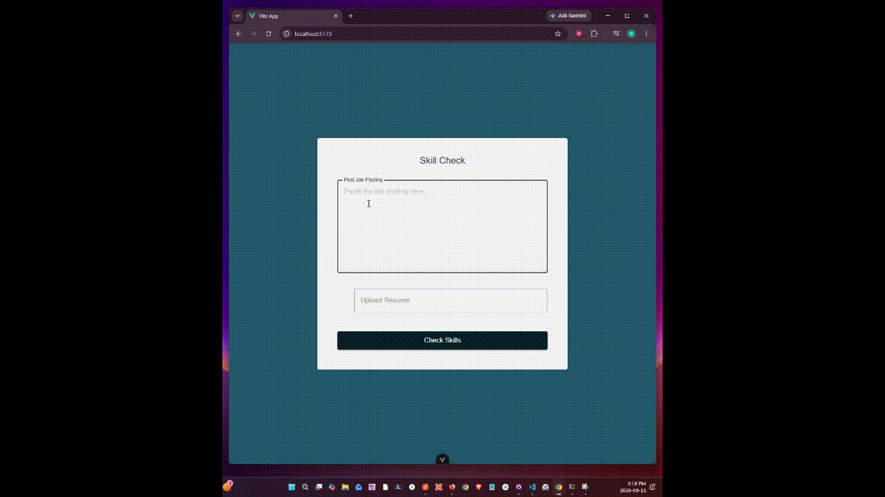

# SkillCheck



Web application that look at the job posting the user
upload and their resume, the app will look for missing
skills listed in the job posting from the resume.

## Dev Setup

### Frontend Setup

Go to Frontend folder, install dependencies.

```bash
  npm install
  npm rund ev
```

### Django Backend Setup

1. Go into the Backend folder and initialize python environment

```bash
  python -m venv venv
  venv/Scripts/activate
  pip install django
```

2. Make sure ollama is running

```bash
  ollama run llama3.2:1b
```

### How to run the server

```bash
  python manage.py runserver
```

### API Available

Note: when using Postman to test locally, there be CSRF cookie not set error.
Go to the endpoint getting tested, use @csrf_exempt
Make sure to remove it after testing.

Example:

```bash
  from django.views.decorators.csrf import csrf_exempt

  @csrf_exempt
  def post_endpoint(request):
    return JsonResponse({"message": "Hello World"}, status=200)

```

In Postman, when calling the skill_check endpoint, do not add content-type in the header.

### Running application with Docker-Compose

```bash
  docker compose up --build -d
```
